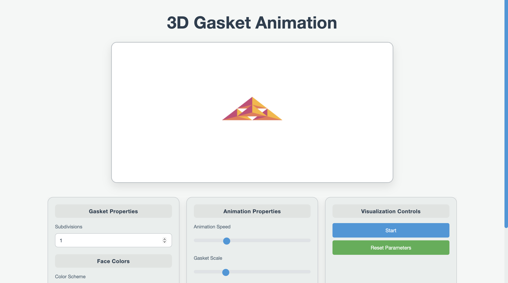

# 3D Gasket TV Ident Animation

<a href="https://lithia22.github.io/CPC354_Assignment_1/" target="_blank">
  
</a>

Click on the image above to visit the project.

## Project Overview:

The **3D Gasket TV Ident Animation** showcases interactive 3D transformations of a gasket shape, featuring rotations, scaling, translations, and color transitions with customizable user controls.

## Main Features:

- **Initial Rotations:** Gasket rotates 180° right and left, then returns to its original position.
- **Enlargement:** Gasket grows and shrinks back to its original size.
- **Translation:** The gasket moves according to the user, including options for:
  - **No rotation** (default)
  - **Rotation around X-axis**
  - **Rotation around Y-axis**
  - **Rotation around Z-axis**

## Additional Features:

- **Subdivision:** Adjusts tetrahedron subdivision level via `NumTimesToSubdivide` slider.
- **Colour Properties:** Choose from custom, monochrome, or pastel color schemes.
- **Animation Speed:** Control animation speed from 0.5 to 2.0 (default: 0.9).
- **Animation Scale:** Adjust scale between 0.3 and 3.0 (default: 1.0).
- **Start/Stop Button:** Toggle animation on/off, pausing and resuming as needed.
- **Reset Button:** Resets animation to its original state and stops any running animations.

## How to Run the Project:

1. **Clone the Repository**

   ```bash
   git clone https://github.com/Lithia22/CPC354_Assignment_1.git
   ```

2. **Navigate to the project directory**
   
   ```bash
   cd CPC354_Assignment_1
   ```

3. **Open Live Server**
